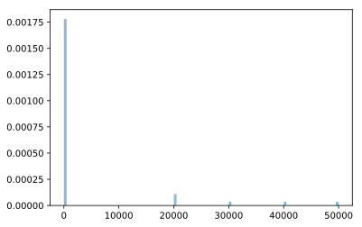
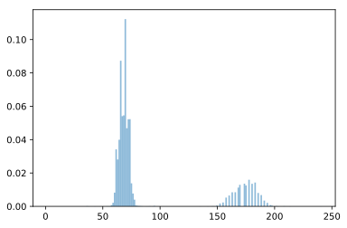
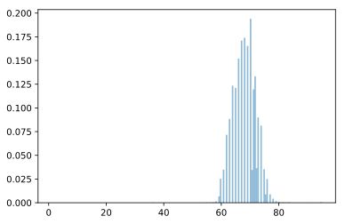
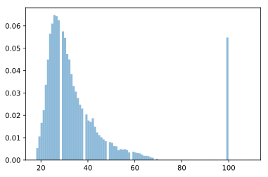
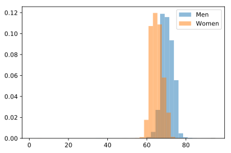
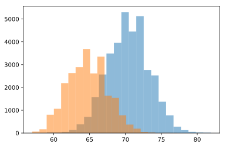

# Data Prep Exercise

__Note: This exercise is not shared with HDS trainees. It is here simply as reference__

## Preparations & Data Loading

### Loading all libraries


```python
%matplotlib inline
%config InlineBackend.figure_format='svg'

from IPython.display import display,HTML
import pandas as pd
# import seaborn as sns
import numpy as np
import matplotlib.pyplot as plt
# sns.set_style("ticks")
# sns.set_context(context="notebook",font_scale=1)
```

### Loading the relevant file


```python
df1 = pd.read_csv('OK_Cupid_profiles.csv')
```

### First inspection of the data


```python
display(df1.head(5))
```


<div>
<style scoped>
    .dataframe tbody tr th:only-of-type {
        vertical-align: middle;
    }

    .dataframe tbody tr th {
        vertical-align: top;
    }

    .dataframe thead th {
        text-align: right;
    }
</style>
<table border="1" class="dataframe">
  <thead>
    <tr style="text-align: right;">
      <th></th>
      <th>age</th>
      <th>body_type</th>
      <th>diet</th>
      <th>drinks</th>
      <th>drugs</th>
      <th>education</th>
      <th>height</th>
      <th>income</th>
      <th>job</th>
      <th>last_online</th>
      <th>orientation</th>
      <th>pets</th>
      <th>religion</th>
      <th>gender</th>
      <th>sign</th>
      <th>smokes</th>
      <th>status</th>
    </tr>
  </thead>
  <tbody>
    <tr>
      <th>0</th>
      <td>22</td>
      <td>a little extra</td>
      <td>strictly anything</td>
      <td>socially</td>
      <td>never</td>
      <td>working on college/university</td>
      <td>75.0</td>
      <td>-1</td>
      <td>transportation</td>
      <td>2012-06-28-20-30</td>
      <td>straight</td>
      <td>likes dogs and likes cats</td>
      <td>agnosticism and very serious about it</td>
      <td>m</td>
      <td>gemini</td>
      <td>sometimes</td>
      <td>single</td>
    </tr>
    <tr>
      <th>1</th>
      <td>35</td>
      <td>average</td>
      <td>mostly other</td>
      <td>often</td>
      <td>sometimes</td>
      <td>working on space camp</td>
      <td>70.0</td>
      <td>80000</td>
      <td>hospitality / travel</td>
      <td>2012-06-29-21-41</td>
      <td>straight</td>
      <td>likes dogs and likes cats</td>
      <td>agnosticism but not too serious about it</td>
      <td>m</td>
      <td>cancer</td>
      <td>no</td>
      <td>single</td>
    </tr>
    <tr>
      <th>2</th>
      <td>38</td>
      <td>thin</td>
      <td>anything</td>
      <td>socially</td>
      <td>NaN</td>
      <td>graduated from masters program</td>
      <td>68.0</td>
      <td>-1</td>
      <td>NaN</td>
      <td>2012-06-27-09-10</td>
      <td>straight</td>
      <td>has cats</td>
      <td>NaN</td>
      <td>m</td>
      <td>pisces but it doesn&amp;rsquo;t matter</td>
      <td>no</td>
      <td>available</td>
    </tr>
    <tr>
      <th>3</th>
      <td>23</td>
      <td>thin</td>
      <td>vegetarian</td>
      <td>socially</td>
      <td>NaN</td>
      <td>working on college/university</td>
      <td>71.0</td>
      <td>20000</td>
      <td>student</td>
      <td>2012-06-28-14-22</td>
      <td>straight</td>
      <td>likes cats</td>
      <td>NaN</td>
      <td>m</td>
      <td>pisces</td>
      <td>no</td>
      <td>single</td>
    </tr>
    <tr>
      <th>4</th>
      <td>29</td>
      <td>athletic</td>
      <td>NaN</td>
      <td>socially</td>
      <td>never</td>
      <td>graduated from college/university</td>
      <td>66.0</td>
      <td>-1</td>
      <td>artistic / musical / writer</td>
      <td>2012-06-27-21-26</td>
      <td>straight</td>
      <td>likes dogs and likes cats</td>
      <td>NaN</td>
      <td>m</td>
      <td>aquarius</td>
      <td>no</td>
      <td>single</td>
    </tr>
  </tbody>
</table>
</div>


```python
display(df1.tail(5))
```


<div>
<style scoped>
    .dataframe tbody tr th:only-of-type {
        vertical-align: middle;
    }

    .dataframe tbody tr th {
        vertical-align: top;
    }

    .dataframe thead th {
        text-align: right;
    }
</style>
<table border="1" class="dataframe">
  <thead>
    <tr style="text-align: right;">
      <th></th>
      <th>age</th>
      <th>body_type</th>
      <th>diet</th>
      <th>drinks</th>
      <th>drugs</th>
      <th>education</th>
      <th>height</th>
      <th>income</th>
      <th>job</th>
      <th>last_online</th>
      <th>orientation</th>
      <th>pets</th>
      <th>religion</th>
      <th>gender</th>
      <th>sign</th>
      <th>smokes</th>
      <th>status</th>
    </tr>
  </thead>
  <tbody>
    <tr>
      <th>59939</th>
      <td>59</td>
      <td>NaN</td>
      <td>NaN</td>
      <td>socially</td>
      <td>1</td>
      <td>graduated from college/university</td>
      <td>62.0</td>
      <td>-1</td>
      <td>sales / marketing / biz dev</td>
      <td>2012-06-12-21-47</td>
      <td>straight</td>
      <td>has dogs</td>
      <td>catholicism but not too serious about it</td>
      <td>f</td>
      <td>cancer and it&amp;rsquo;s fun to think about</td>
      <td>no</td>
      <td>single</td>
    </tr>
    <tr>
      <th>59940</th>
      <td>24</td>
      <td>fit</td>
      <td>mostly anything</td>
      <td>often</td>
      <td>2</td>
      <td>working on college/university</td>
      <td>72.0</td>
      <td>-1</td>
      <td>entertainment / media</td>
      <td>2012-06-29-11-01</td>
      <td>straight</td>
      <td>likes dogs and likes cats</td>
      <td>agnosticism</td>
      <td>m</td>
      <td>leo but it doesn&amp;rsquo;t matter</td>
      <td>no</td>
      <td>single</td>
    </tr>
    <tr>
      <th>59941</th>
      <td>42</td>
      <td>average</td>
      <td>mostly anything</td>
      <td>not at all</td>
      <td>1</td>
      <td>graduated from masters program</td>
      <td>71.0</td>
      <td>100000</td>
      <td>construction / craftsmanship</td>
      <td>2012-06-27-23-37</td>
      <td>straight</td>
      <td>NaN</td>
      <td>christianity but not too serious about it</td>
      <td>m</td>
      <td>sagittarius but it doesn&amp;rsquo;t matter</td>
      <td>no</td>
      <td>single</td>
    </tr>
    <tr>
      <th>59942</th>
      <td>27</td>
      <td>athletic</td>
      <td>mostly anything</td>
      <td>socially</td>
      <td>3</td>
      <td>working on college/university</td>
      <td>73.0</td>
      <td>-1</td>
      <td>medicine / health</td>
      <td>2012-06-23-13-01</td>
      <td>straight</td>
      <td>likes dogs and likes cats</td>
      <td>agnosticism but not too serious about it</td>
      <td>m</td>
      <td>leo and it&amp;rsquo;s fun to think about</td>
      <td>trying to quit</td>
      <td>single</td>
    </tr>
    <tr>
      <th>59943</th>
      <td>39</td>
      <td>average</td>
      <td>NaN</td>
      <td>socially</td>
      <td>NaN</td>
      <td>graduated from masters program</td>
      <td>68.0</td>
      <td>-1</td>
      <td>medicine / health</td>
      <td>2012-06-29-00-42</td>
      <td>gay</td>
      <td>likes dogs and likes cats</td>
      <td>catholicism and laughing about it</td>
      <td>m</td>
      <td>gemini and it&amp;rsquo;s fun to think about</td>
      <td>sometimes</td>
      <td>single</td>
    </tr>
  </tbody>
</table>
</div>


#  Data issue exploration

## DATA ISSUE 1: Missing values - across columns

### Count the number of NA values by column


```python
df1.isnull().sum(axis = 0)
```


    age                0
    body_type       5296
    diet           24394
    drinks          2985
    drugs          14079
    education       6628
    height             3
    income             0
    job             8198
    last_online        0
    orientation        0
    pets           19920
    religion       20226
    gender             0
    sign           11056
    smokes          5512
    status             0
    dtype: int64


## DATA ISSUE 2: Missing data - Income data

### Use a historigram to show the distribution of the income data


```python
plt.hist(df1[df1.income<=50000]['income'].dropna(), bins = 100, alpha = 0.5, density=True)
plt.show()

```





## DATA ISSUE 3: Changing Scales - Height

### Let's start with checking whether the height distribution looks normal


```python
plt.hist(df1['height'].dropna(), bins = 180, alpha = 0.5, density=True)
plt.show()
```





### From the average heights for male and female and the graph above, it looks as if part of the heights has been entered in inches, and part of the heights has been entered in cm. Let's convert all to inches.


```python
df1['cons_height'] = np.where(df1['height']>=100, df1['height']/2.54, df1['height'])
```


```python
display(df1.cons_height.describe())
plt.hist(df1['cons_height'].dropna(), bins = 180, alpha = 0.5, density=True)
plt.show()
```


    count    59941.000000
    mean        68.298895
    std          3.987246
    min          1.000000
    25%         66.000000
    50%         68.110236
    75%         71.000000
    max         95.000000
    Name: cons_height, dtype: float64





## DATA ISSUE 4: Drugs - change scale “never”, “sometimes”, “often” to respectively 1,2,3 

### Let's start with inspecting the data


```python
display(pd.value_counts(df1['drugs'].values, sort=True))
```


    never        22156
    1            15567
    sometimes     4562
    2             3170
    often          242
    3              168
    dtype: int64


## DATA ISSUE 5: Age outliers - Ignore people "older than" 99

### We start with inspecting the data


```python
plt.hist(df1['age'].dropna(), bins = 100, alpha = 0.5, density=True)
plt.show()
```





## Height Distribution Check


```python
men_df = df1[df1['gender'] == 'm']
wom_df = df1[df1['gender'] == 'f']

plt.hist(men_df['cons_height'].dropna(), bins=40, alpha=0.5, label='Men', normed = True)
plt.hist(wom_df['cons_height'].dropna(), bins=40, alpha=0.5, label='Women', normed = True)
                
plt.legend(loc='upper right')
plt.show()

men_height = pd.to_numeric(men_df['cons_height'], errors='coerce').dropna()
wom_height = pd.to_numeric(wom_df['cons_height'], errors='coerce').dropna()

display("Men average {} in or {} cm".format(men_height.mean(), men_height.mean() * 2.54))
display("Women average {} in or {} cm".format(wom_height.mean(), wom_height.mean() * 2.54))


men_height = men_height[(men_height>56) & (men_height<82)]
wom_height = wom_height[(wom_height>56) & (wom_height<82)]
```

    C:\ML\anaconda3\lib\site-packages\matplotlib\axes\_axes.py:6521: MatplotlibDeprecationWarning: 
    The 'normed' kwarg was deprecated in Matplotlib 2.1 and will be removed in 3.1. Use 'density' instead.
      alternative="'density'", removal="3.1")





    'Men average 70.44800808831876 in or 178.93794054432965 cm'


    'Women average 65.10632761860876 in or 165.37007215126624 cm'


___What you should see:___

Both men and women who go online are magically 4 cm taller than average for cdc :)


```python
plt.hist(men_height, bins=23, alpha=0.5, label='Men')
plt.hist(wom_height, bins=20, alpha=0.5, label='Women')
```


    (array([  66.,  167.,  802., 1064., 2189., 2631., 2888., 3681., 2614.,
            3352., 1641., 1543.,  779.,  373.,  194.,   53.,   23.,    4.,
               9.,    4.]),
     array([57.        , 58.00826772, 59.01653543, 60.02480315, 61.03307087,
            62.04133858, 63.0496063 , 64.05787402, 65.06614173, 66.07440945,
            67.08267717, 68.09094488, 69.0992126 , 70.10748031, 71.11574803,
            72.12401575, 73.13228346, 74.14055118, 75.1488189 , 76.15708661,
            77.16535433]),
     <a list of 20 Patch objects>)





___What we see___:
* Thnik we have some eager over-estimators here:
* Women peak is at 62" which is actually reasonable
* Men peak at 70 and 72" (nice round 6' ft choice)
 * Actual peak is at 68 to 70 (if we're really generous)
 * so a nice 2" bump for most men
